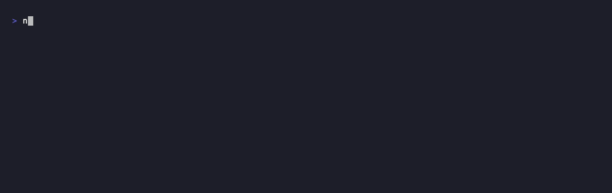

# agentwatch

[](https://www.npmjs.com/package/@davidcjw/agentwatch)
[](https://github.com/davidcjw/agentwatch/actions/workflows/ci.yml)


**A live perch over your Claude Code agents.** A zero-dependency terminal
dashboard that shows every active session in real time — what each one is doing
*right now*, how many tokens and dollars it's burning, and whether it's quietly
waiting on **you**.

If you run more than one Claude Code agent at a time (worktrees, parallel tabs,
background tasks), you've felt the problem: you can't see the flock. agentwatch
is that missing live view. It's the runtime sibling to
[agentmeter](https://github.com/davidcjw/agentmeter) — agentmeter tells you what
your agents *cost after the fact*; agentwatch tells you what they're *doing now*.

<p align="center">
  
</p>

```
● agentwatch                                                              1:22:39 am
1 working  2 need you  2 idle  ·  window spend $3.44

STATUS           PROJECT        WHAT                                  MODEL       TOK   COST   AGE
▲ awaiting you   payments-api   Fix the failing auth-token refresh …  opus-4-8   878k $1.03    3m
■ stalled: Bash  data-pipeline  Backfill last quarter of events       opus-4-8   1.2M $1.37   15m
⠋ Edit           acme-dashboard Add the cohort retention heatmap      opus-4-8   586k   69¢    5s
· idle           blog-engine    Draft the release-notes post          opus-4-8    98k   11¢   25m

q quit  r refresh  a all/active
```

<sub>Demo recorded with [vhs](https://github.com/charmbracelet/vhs) against a synthetic transcript root — regenerate with `vhs docs/demo.tape`.</sub>

It reads your local Claude Code transcripts (`~/.claude/projects`). Nothing is
sent anywhere; there is no network access and no configuration.

## Install

```bash
npx @davidcjw/agentwatch    # run without installing
# or
npm install -g @davidcjw/agentwatch
```

Requires Node ≥ 18.

## Usage

```bash
agentwatch                  # live dashboard — sessions active in the last 30 min
agentwatch --all            # every session on disk, newest first
agentwatch --window 120     # widen the active window to 2 hours
agentwatch --once           # render a single frame and exit (screenshots, cron)
agentwatch --json | jq .    # machine-readable summaries
```

Keys while running: **q** quit · **r** force refresh · **a** toggle all/active.

### Options

| Option | Default | Meaning |
| --- | --- | --- |
| `--window <min>` | `30` | Only show sessions whose transcript was written in the last N minutes. |
| `--all` | — | Show every session regardless of age. |
| `--active <sec>` | `15` | A transcript written this recently counts as "working now". |
| `--stall <sec>` | `600` | A tool call pending longer than this is flagged "stalled" (likely a long run or an open permission prompt). |
| `--interval <ms>` | `2000` | How often to rescan transcripts. The spinner repaints faster. |
| `--once` | — | One frame, no live loop. |
| `--json` | — | Print session summaries as JSON and exit. |
| `--root <path>` | `~/.claude/projects` | Transcript directory. |
| `--no-color` | — | Disable ANSI color (also respects `NO_COLOR`). |

## Status legend

| | State | Meaning |
| --- | --- | --- |
| `●` | **working / tool name** | A tool is executing right now (shows the tool, e.g. `Bash`, `sub:Grep` for a subagent). |
| `◐` | **thinking** | The model is generating after a tool result or your message. |
| `◑` | **replying** | The model is streaming its answer. |
| `▲` | **awaiting you** | It finished its turn and is waiting for your next message. |
| `■` | **stalled** | A tool has been pending a long time — a long-running command, or an open permission prompt that needs you. |
| `○` | **ended** | Content alone looked like "awaiting you" / "stalled", but no `claude` process is actually running for it anymore — see below. |
| `·` | **idle** | No recent activity. |

Sessions that **need you** (awaiting / stalled) sort to the top.

## How status is inferred

Claude Code appends to a session's JSONL transcript on every event, so the
file's **modification time** is a reliable "something is happening" signal, and
the **last content block** says what:

- a **pending `tool_use`** (no matching result yet) → a tool is running, or a
  permission prompt is open;
- a recent **`tool_result`** or your message → the model is **thinking**;
- a recent **assistant text** block → it's **replying**;
- assistant text that's since gone quiet → it's **awaiting you**.

This is a heuristic read of an append-only log, not an instrumented hook, so a
very long model turn can briefly read as quiet. Tune `--active` / `--stall` to
taste. Title and last prompt come from the `ai-title` and `last-prompt` records
Claude Code writes; tokens and cost reuse agentmeter's pricing model.

Content alone can't distinguish "genuinely waiting on you" from "the process
already exited" — a finished `claude -p` one-shot ends its transcript with an
assistant text block exactly like a live session paused for your input. To
tell those apart, agentwatch cross-checks the local process table (`ps` +
`lsof`) on every tick: if no `claude` process is running for a session's
`cwd`, an `await`/`stall` label is deterministically downgraded to **ended**
instead of trusting the stale heuristic. This is best-effort and macOS/Linux
only — if `ps`/`lsof` are unavailable, or two sessions share a cwd and only
one has exited, agentwatch leaves the heuristic label alone rather than
guessing wrong.

## Performance

Every tick stats the transcript files (no reads) and only re-parses the few
whose contents changed since the last scan; unchanged sessions are re-clocked
without touching disk. Hundreds of transcripts refresh in a few milliseconds.

## Library use

```js
import { scan } from 'agentwatch';

const sessions = scan('/Users/me/.claude/projects', { now: Date.now(), windowMin: 30 });
// → [{ project, title, lastPrompt, model, status: { state, label }, ageSec, tokens, cost, ... }]
```

## The suite

agentwatch is part of a small family of zero-dependency, local-first tools for
the AI-agent era:

- **[agentmeter](https://github.com/davidcjw/agentmeter)** — what your agents cost (historical).
- **agentwatch** — what your agents are doing (live). ← you are here
- **[ctxbudget](https://github.com/davidcjw/ctxbudget)** — the token cost of your context files.
- **[questlog](https://github.com/davidcjw/questlog)** — which of your repos need attention.
- **[portcull](https://github.com/davidcjw/portcull)** — list/kill processes holding dev ports.

## License

MIT © David Chong
